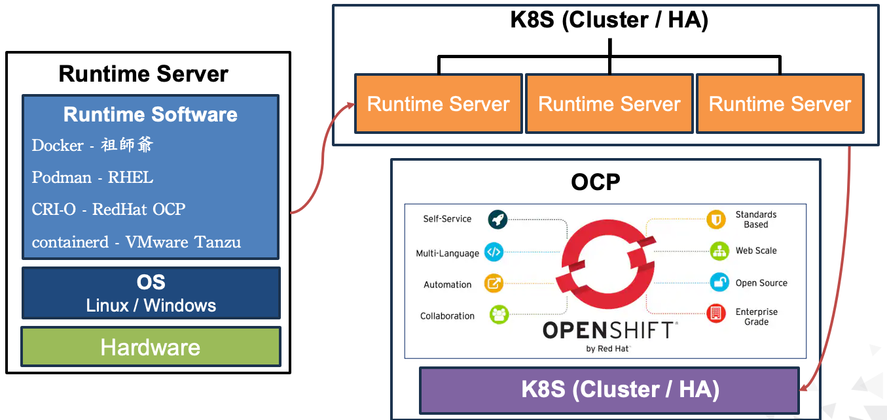

## Docker Overview
### Container介紹
* 容器（Container）：運行在Image上的應用程式，如 Web Service、Dell SCG、網路銀行APP...等。<br>

|優點|缺點|
|---|---|
|因運行在Image上，無須作業系統，資源利用率高、容量需求小、啟動極快|每個應用程式，需一個容器或數十個容器組成，管理較為不易|
|無須擔心系統故障，只需在相同Image上，重啟另一個容器即可|共用宿主主機及Image，若有漏洞則容易造成安全上隱憂|
|搭配K8S或OCP等管理工具，極易擴展、縮減、HA|網路與傳統網路不同，如Service、Ingress..等，學習曲線較高|

### Container架構示意圖


### Docker前世今生
* Docker 是一種輕量級虛擬化技術，可建立獨立的容器 (Container)，能夠快速地進行開發、交付、部署、測試應用程式。
* 因Docker與K8S介接，需使用到Dockershim，維護成本過高，2022年5月K8Sv1.24宣布移除 Dockershim，使得Docker無法使用於K8S上。
* 之後Mirantis公司接手維護Dockershim，將之前Docker Enterprise Edition改名Mirantis Kubernetes Engine (MKE)。

### Docker三大組成元件
* 映像檔 (Image)：用來建立 Container 的應用程式環境，是一個類似 VM 的 ISO 檔。
* 容器 (Container)：Container 是由 Image 所建立，運行於Runtime上。
* 倉庫 (Registry)：用來管理 Image的空間，包含版本及標籤的 Images 集合。


## Docker 安裝
### 線上安裝
```
curl -fsSL https://get.docker.com | sh
start docker && systemctl enable docker
```
### 離線安裝
* 先至[Docker官網](https://download.docker.com/linux/static/stable/x86_64/)下載最新Docker。
```
tar -xvf docker-29.1.3.tgz
cp docker/* /usr/bin/

vi /etc/systemd/system/docker.service
=============================
[Unit]
Description=Docker Application Container Engine
Documentation=https://docs.docker.com
After=network-online.target firewalld.service
Wants=network-online.target

[Service]
Type=notify
ExecStart=/usr/bin/dockerd
ExecReload=/bin/kill -s HUP $MAINPID
LimitNOFILE=infinity
LimitNPROC=infinity
LimitCORE=infinity
TimeoutStartSec=0
Delegate=yes
KillMode=process
Restart=on-failure
StartLimitBurst=3
StartLimitInterval=60s

[Install]
WantedBy=multi-user.target
=============================

chmod +x /etc/systemd/system/docker.service
systemctl daemon-reload
systemctl start docker
systemctl enable docker.service

# 檢查安裝是否完成
root@ubuntu:~# docker -v
Docker version 29.1.3, build f52814d
```

## Image 管理
### 下載Image
```
root@ubuntu:~# docker pull mysql
Using default tag: latest
latest: Pulling from library/mysql
3cd9dbd900b6: Pull complete
4739ccce10fe: Pull complete
94829adeb7d5: Pull complete
32ade1562315: Pull complete
fe33d02f9e9d: Pull complete
5b7494a5617c: Pull complete
518fdee9efbe: Pull complete
bc357b5ee6d2: Pull complete
c977bb812578: Pull complete
26040ca4b0ff: Pull complete
4fdb57154777: Download complete
64911a6c79e2: Download complete
Digest: sha256:5ca0a273ed28c73acaef91da8bf1eca3711bee94bce4c378d42846375e645a72
Status: Downloaded newer image for mysql:latest
docker.io/library/mysql:latest

# 檢查Image
root@ubuntu:~# docker image ls
IMAGE          ID             DISK USAGE   CONTENT SIZE   EXTRA
mysql:latest   5ca0a273ed28       1.29GB          293MB

# 若有無法下載，代表無官方Image，使用search尋找
root@ubuntu:~# docker pull centos
Using default tag: latest
Error response from daemon: failed to resolve reference "docker.io/library/centos:latest": docker.io/library/centos:latest: not found

root@ubuntu:~# docker search centos
NAME                           DESCRIPTION                                     STARS     OFFICIAL
centos                         DEPRECATED; The official build of CentOS.       7781      [OK]
corpusops/centos               centos corpusops baseimage                      0
dockette/centos                My Custom CentOS Dockerfiles                    1
eclipse/centos                 CentOS based minimal stack with only git and…   1
centos/postgresql-10-centos7   PostgreSQL is an advanced Object-Relational …   21
centos/redis-5-centos8                                                         0
centos/httpd-24-centos8                                                        3
centos/mysql-80-centos8                                                        0
centos/nginx-112-centos7       Platform for running nginx 1.12 or building …   16
centos/mongodb-36-centos7      MongoDB NoSQL database server                   12
centos/postgresql-10-centos8                                                   0
centos/postgresql-12-centos8                                                   0
centos/mysql-57-centos7        MySQL 5.7 SQL database server                   94
centos/mariadb-103-centos8                                                     2
centos/httpd-24-centos7        Platform for running Apache httpd 2.4 or bui…   46
centos/systemd                 systemd enabled base container.                 114
centos/mariadb-101-centos7     MariaDB 10.1 SQL database server                13
centos/postgresql-96-centos7   PostgreSQL is an advanced Object-Relational …   45
centos/nginx-18-centos7        Platform for running nginx 1.8 or building n…   14
centos/redis-32-centos7        Redis in-memory data structure store, used a…   6
centos/python-35-centos7       Platform for building and running Python 3.5…   39
centos/mysql-56-centos7        MySQL 5.6 SQL database server                   23
centos/ruby-22-centos7         Platform for building and running Ruby 2.2 a…   3
centos/php-56-centos7          Platform for building and running PHP 5.6 ap…   34
centos/nginx-114-centos8                                                       0
```

### 刪除Image
```
root@ubuntu:~# docker rmi mysql
Untagged: mysql:latest
Deleted: sha256:5ca0a273ed28c73acaef91da8bf1eca3711bee94bce4c378d42846375e645a72
```


