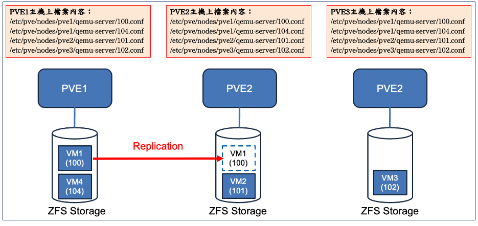
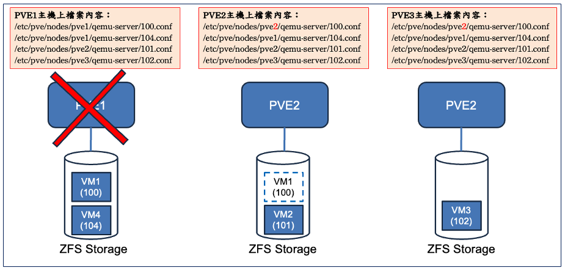

## Replication
### 基本介紹
- Replication 為 PVE 內建功能，以 VM 為單位需手動進行設定
- Replication 需搭配 ZFS Storage 才能使用，且每台Node上ZFS Storage 命名皆需相同
- 為增量同步進行抄寫，抄寫可自訂頻率，最低為一分鐘一次

### 切換方式
- PVE 會自動將三台 Node 上的 /etc/pve/nodes 資料保持同步狀態
- 此資料紀錄著彼此每個 Node 上的 VM 設定檔
  
- PVE1 故障時，需在 PVE2 主機上，將原位於 pve1 資料夾中的 100.conf 移至 pve2 資料夾，並啟動 VM1
- PVE3 會隨著 PVE2 資料夾變更而同步更新，PVE1 修復後亦會與 PVE2 保持設定檔同步
  

### Replication設定
```
root@pve1:~# pvesr create-local-job 100-0 pve2 --schedule "*/5"

root@pve1:~# pvesr status
JobID      Enabled    Target                           LastSync             NextSync   Duration  FailCount State
100-0      Yes        local/pve2                              -              pending          -          0 OK

root@pve1:~# pvesr status
JobID      Enabled    Target                           LastSync             NextSync   Duration  FailCount State
100-0      Yes        local/pve2                              -  2025-12-27_21:10:00          -          0 SYNCING

root@pve1:~# pvesr status
JobID      Enabled    Target                           LastSync             NextSync   Duration  FailCount State
100-0      Yes        local/pve2            2025-12-27_21:11:16  2025-12-27_21:15:00   3.554485          0 OK

root@pve1:~# pvesr create-local-job 100-1 pve3 --schedule hourly

root@pve1:~# pvesr status
JobID      Enabled    Target                           LastSync             NextSync   Duration  FailCount State
100-0      Yes        local/pve2            2025-12-27_21:12:16  2025-12-27_21:15:00    3.47269          0 OK
100-1      Yes        local/pve3            2025-12-27_21:13:16  2025-12-27_22:00:00  77.550764          0 OK

root@pve1:~# pvesr delete 100-0
Replication job removal is a background task and will take some time.

root@pve1:~# pvesr status
JobID      Enabled    Target                           LastSync             NextSync   Duration  FailCount State
100-1      Yes        local/pve3            2025-12-27_21:13:16  2025-12-27_22:00:00  77.550764          0 OK
```

### 故障演練
- 切換後若故障Node修復，將會反向抄寫回原本PVE1上
```
# 直接關閉PVE1
root@pve3:~# ssh root@172.22.46.231 shutdown -h now
The authenticity of host '172.22.46.231 (172.22.46.231)' can't be established.
ED25519 key fingerprint is SHA256:PqvbWUMz+2FVLUJqGETjmX26iB4KKQoWDlz2VrkxMks.
This key is not known by any other names.
Are you sure you want to continue connecting (yes/no/[fingerprint])? yes
Warning: Permanently added '172.22.46.231' (ED25519) to the list of known hosts.

# 查看PVE1是否關機，關機後將不會出現在Cluster中
root@pve3:~# pvecm status
Cluster information
----------------------
    Nodeid      Votes Name
0x00000002          1 172.22.46.232
0x00000003          1 172.22.46.233 (local)

# 將PVE1 100.conf（VM的Config檔案），移動到PVE3相同資料夾上上
root@pve3:~# mv /etc/pve/nodes/pve1/qemu-server/100.conf /etc/pve/nodes/pve3/qemu-server/100.conf

# 查看VM是否在PVE3中出現
root@pve3:~# qm list
      VMID NAME                 STATUS     MEM(MB)    BOOTDISK(GB) PID
       100 vm1                  stopped    4096              10.00 0

# 將VM開機
root@pve3:~# qm start 100

root@pve3:~# qm list
      VMID NAME                 STATUS     MEM(MB)    BOOTDISK(GB) PID
       100 vm1                  running    4096              10.00 1102852

# 切換後若故障Node修復，將會反向抄寫回原本PVE1上
root@pve3:~# pvesr status
JobID      Enabled    Target                           LastSync             NextSync   Duration  FailCount State
100-1      Yes        local/pve1            2025-12-27_21:46:11  2025-12-27_22:00:00   4.085043          0 OK

```

### 相關內容：
- 即時刪除Replication Job，Target資料也會一併刪除
- 二台Node有Replication關係下，可進行VM Migrate，完成後會反向抄寫
- 在ZFS Storage下的VM，在無Replication關係的Node，是無法進行Migrate
