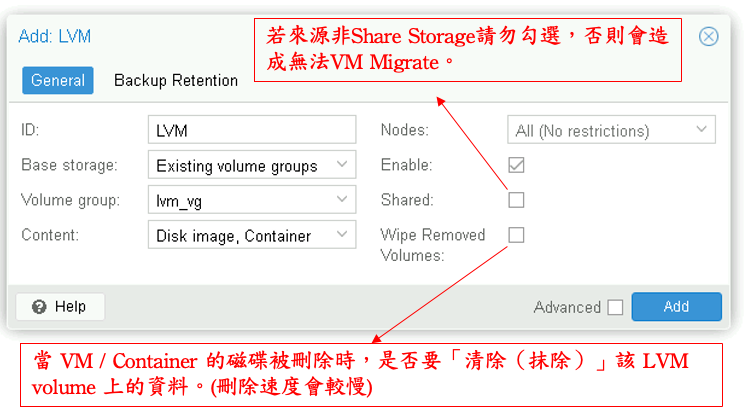
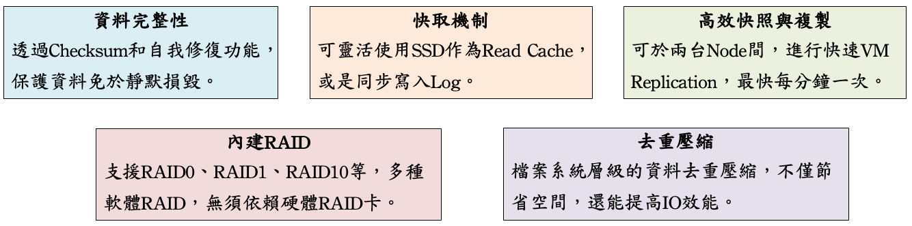
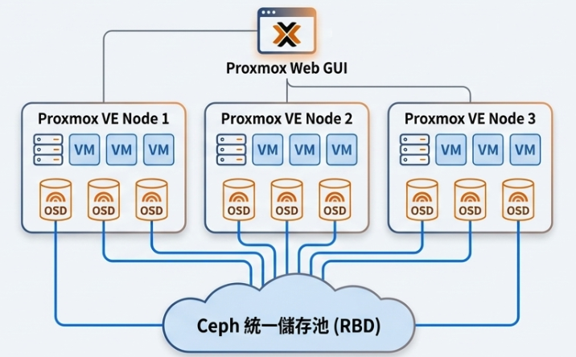

## 1、LAB環境資訊
| PVE Host | 第一組PVE | 第二組PVE | 第三組PVE | 第四組PVE |
|------|------|------|------|------|
| MGMT IP | 172.22.46.231~233 | 172.22.46.234~236 | 172.22.46.237~239 | 172.22.46.221~223 |
| iSCSI 130 | 10.10.130.231 | 10.10.130.234 | 10.10.130.237 | 10.10.130.221 |
| iSCSI 131 | 10.10.131.231 | 10.10.131.234 | 10.10.131.237 | 10.10.131.221 |
| Replication | 10.10.10.231 | 10.10.10.234 | 10.10.10.237 | 10.10.10.221 |
| NFS (20GB) | 172.22.46.242/nfs1 | 172.22.46.242/nfs2 | 172.22.46.242/nfs3 | 172.22.46.242/nfs4 |
| CIFS (20GB) | 172.22.46.243/cifs1 | 172.22.46.243/cis2 | 172.22.46.243/cifs3 | 172.22.46.243/cifs4 |
| Local HD | 30GB X 3 | 30GB X 3 | 30GB X 3 | 30GB X 3 |
| iSCSI | 40GB X 1 + 50GB X 1 | 40GB X 1 + 50GB X 1 | 40GB X 1 + 50GB X 1| 40GB X 1 + 50GB X 1 |


| Storage | MGMT IP | iSCSI 130 | iSCSI 131 |
|------|------|------|------|
| UnityVSA | 172.22.46.241 | 10.10.130.241 | 10.10.130.241 |

## 2、初始設定
### 時間校時
```
nano /etc/chrony/chrony.conf
======================
# 註解掉
#pool 2.debian.pool.ntp.org iburst
# 增加
server 172.22.46.250 iburst
======================
systemctl enable chrony --now
systemctl restart chronyd
chronyc -a makestep
date

# 如果差距太大，先使用手動修正
systemctl stop chrony
timedatectl set-time "2025-12-24 08:01:00"
systemctl start chrony
chronyc -a makestep
```
### 移除未訂閱
```
sed -i.bak "s/data.status.toLowerCase() !== 'active'/false/g" /usr/share/javascript/proxmox-widget-toolkit/proxmoxlib.js
systemctl restart pveproxy.service
```
### 線上更新
```
rm /etc/apt/sources.list.d/pve-enterprise.sources
rm /etc/apt/sources.list.d/ceph.sources
sed -i 's|http://ftp.debian.org|https://mirrors.ustc.edu.cn|g' /etc/apt/sources.list
sed -i 's|http://security.debian.org|https://mirrors.ustc.edu.cn/debian-se...|g' /etc/apt/sources.list
apt update && apt full-upgrade -y
```
### 常用指令
```
# 顯示所有Storage狀態
root@pve1:~# pvesm status
Name             Type     Status           Total            Used       Available        %
NFS_1             nfs     active        20971520         5750144        15221376   27.42%
local             dir     active        35679784         5495612        28339540   15.40%
local-lvm     lvmthin     active        44298240         3707762        40590477    8.37%

# 顯示Storage Info
root@pve1:~# qemu-img info /mnt/pve/NFS/images/101/vm-101-disk-0.raw
image: /mnt/pve/NFS/images/101/vm-101-disk-0.raw
file format: raw
virtual size: 10 GiB (10737418240 bytes)
disk size: 10 GiB
Child node '/file':
    filename: /mnt/pve/NFS/images/101/vm-101-disk-0.raw
    protocol type: file
    file length: 10 GiB (10737418240 bytes)
    disk size: 10 GiB

# Storage 格式轉換
qemu-img convert -p -t none -T none -f raw -O qcow2 /mnt/pve/NFS/images/101/vm-101-disk-0.raw /mnt/pve/NFS/images/101/vm-101-disk-0.qcow2

```
### Multipath安裝
```
# 方式一：線上安裝(所有Node皆需安裝)
apt install multipath-tools -y

# 方式二：離線安裝(所有Node皆需安裝)
tar -xvf multipath.tar
cd multipath
dpkg -i *.deb
systemctl enable multipathd && systemctl start multipathd

vi /etc/multipath.conf
=======================
defaults {
    user_friendly_names yes
    find_multipaths yes
    path_grouping_policy    multibus
    path_selector           "round-robin 0"
    failback                immediate
    rr_min_io               1
    max_fds                 max
    rr_weight               priorities
}

blacklist {
    devnode "^sda" 
}
=======================
reboot
multipath -ll
lsblk
```

### iSCSI設定
```
# iSCSI Discovery
iscsiadm -m discovery -t st -p 10.10.130.241:3260
iscsiadm -m node -T iqn.1992-04.com.emc:cx.virt2549tprtqf.a2 -l
iscsiadm -m node -T iqn.1992-04.com.emc:cx.virt2549tprtqf.a3 -l
iscsiadm -m node -T iqn.1992-04.com.emc:cx.virt2549tprtqf.a2 -p 10.10.130.241 --op update -n node.startup -v automatic
iscsiadm -m node -T iqn.1992-04.com.emc:cx.virt2549tprtqf.a3 -p 10.10.131.241 --op update -n node.startup -v automatic

# 查詢PVE iqn
cat /etc/iscsi/initiatorname.iscsi

# 重新掃描Disk
iscsiadm -m session --rescan
lsblk
```

## 3、PVE Storage Type
### PVE Storage架構


### 主要PVE Storage比較
| Storage Type | Content | Disk | Share | Snapshot | Note |
|:------:|:------:|:------:|:------:|:------:|:------:|
| Diretory | All | Local / External | ❌ | ✅ | 使用本機目錄或Disk，成為Storage |
| LVM | Image | Local / External | ✅ | ❌ | 可當成Share Storage使用（需使用外部磁碟） |
| LVM-Thin | Image | Local / External | ❌ | ✅ | 支援Snapshot、Thin Provisioning |
| BTRFS | All | Local / External | ✅ | ✅ | 內建軟體RAID，並有資料驗證功能 |
| NFS | All | External | ✅ | ❌ | 使用外部儲存NAS，進行NFS存取 |
| SMB / CIFS | All | External | ✅ | ❌ | 使用外部儲存NAS，進行CIFS存取 |
| iSCSI | Image | External | ❌ | ❌ | 類似VMWare RDM，將外部空間掛載給Guest使用|
| Local-LVM | Image | Local | ❌ | ✅ | 預設Storage |
| Ceph | Image | Local | ✅ | ✅ | 分散式儲存，建置HCI需使用此Storage |
| ZFS | Image | Local | ❌ | ✅ | Replication需使用ZFS Storage |

## 4、local / local-lvm
每台Node預設皆有兩個Local Storage。<br>
1.local（Directory）：File level storage 可存放ISO、Container Template、備份檔案等。<br>
2.local-lvm（LVM-Thin）： Block level storage 只能放置VM或Container的Image。

## 5、Directory
Directory 是以PVE本身空間建立目錄或使用整顆空磁碟，當成Storage使用。<br>
1.為File-based類型Storage。<br>
2.只要 Linux 核心能掛載的檔案系統（ext4, xfs, nfs, btrfs, smb/cifs），都可以定義為 Directory。<br>

### 建立方式
1.於DC建立會將每個Node資料夾當成Storage使用，並會同時建立時三台Node相同資料夾。<br>
2.於Node建立可用整顆Local Disk，當成Storage使用，建立時需選擇File system ext4/xfs。

### Directory over iSCSI
```
＃ fdisk
root@pve1:~# fdisk /dev/mapper/mpatha

Command (m for help): n

Partition type
   p   primary (0 primary, 0 extended, 4 free)
   e   extended (container for logical partitions)
Select (default p):

Using default response p.
Partition number (1-4, default 1):
First sector (8192-104857599, default 8192):
Last sector, +/-sectors or +/-size{K,M,G,T,P} (8192-104857599, default 104857599):

Command (m for help): w

# Format
root@pve1:~# mkfs.xfs /dev/mapper/mpatha-part1

# Mount
root@pve1:~# mkdir -p /mnt/unity-iscsi

root@pve1:~# mount /dev/mapper/mpatha-part1 /mnt/unity-iscsi

root@pve1:~# df -h
Filesystem                Size  Used Avail Use% Mounted on
udev                       16G     0   16G   0% /dev
tmpfs                     3.2G  1.2M  3.2G   1% /run
/dev/mapper/pve-root       35G  3.3G   29G  11% /
tmpfs                      16G   57M   16G   1% /dev/shm
tmpfs                     1.0M     0  1.0M   0% /run/credentials/systemd-journald.service
tmpfs                     5.0M     0  5.0M   0% /run/lock
tmpfs                      16G     0   16G   0% /tmp
/dev/fuse                 128M   28K  128M   1% /etc/pve
tmpfs                     3.2G  4.0K  3.2G   1% /run/user/0
tmpfs                     1.0M     0  1.0M   0% /run/credentials/getty@tty1.service
/dev/mapper/mpatha-part1   50G 1013M   49G   2% /mnt/unity-iscs
```

## 6、LVM
 <br>
LVM可將可用磁碟空間，融合成一個Volume Group，再彈性劃分成隨意大小的邏輯磁碟區（LV）。
1.LVM：可當成Share Storage使用（若使用iSCSI / FC掛載空間），不支援Snapshot、Thin Provisioning。
2.LVM-Thin：無法與Node共用，支援Snapshot、Thin Provisioning。

### 建置LVM
```
root@pve1:~# pvcreate /dev/mapper/mpatha  （每台Node都做）
  Physical volume "/dev/mapper/mpatha" successfully created.

root@pve1:~# vgcreate lvm_vg /dev/mapper/mpatha
  Volume group "lvm_vg" successfully created

# 使用LVM-thin需多加下列步驟
root@pve1:~# lvcreate -l 100%FREE --thinpool thinpool lvm_vg
  Thin pool volume with chunk size 64.00 KiB can address at most <15.88 TiB of data.
  Logical volume "thinpool" created.
```


### 移除LVM
```
root@pve1:~# vgs
  VG         #PV #LV #SN Attr   VSize   VFree
  lvm_vg       1   0   0 wz--n- <30.00g <30.00g
  lvmthin_vg   1   1   0 wz--n- <30.00g      0
  pve          1   4   0 wz--n- <99.50g <12.38g
  
root@pve1:~# lvremove lvmthin_vg
Do you really want to remove active logical volume lvmthin_vg/thinpool? [y/n]: y
  Logical volume "thinpool" successfully removed.
  
root@pve1:~# vgremove lvmthin_vg
  Volume group "lvmthin_vg" successfully removed

# 每台Node皆需執行
root@pve1:~# pvremove /dev/sdd
  Labels on physical volume "/dev/sdd" successfully wiped.
```

## 7、BTRFS
1.內建軟體RAID。 <br>
2.可放置Block及File。 <br>
3.可建置多個子磁碟。

### 建立BTRFS
```
# 單顆磁碟：
mkfs.btrfs -L data-btrfs /dev/sdb

# 若兩顆磁碟做 RAID 1：
mkfs.btrfs -m raid1 -d raid1 -L data-btrfs /dev/sdb /dev/sdc

# 建立掛載點：
mkdir /mnt/data-btrfs

# 查看 UUID（若為RAID 1，兩顆UUID應為一致）
blkid /dev/sdb 

# 編輯 /etc/fstab 讓系統開機自動掛載
nano /etc/fstab
UUID=87547b3d-b019-4578-a965-02883aa6a830 /mnt/data-btrfs btrfs defaults 0 0
mount -a
df -h

＃ PVE Web UI 新增BTRFS，掛載/mnt/data-btrfs

# 其餘Node若需使用(才能進行Migrate)，需進行Format / Mount
mkfs.btrfs -m raid1 -d raid1 -L data-btrfs /dev/sdb /dev/sdc
mount UUID=486307f1-a69c-4364-8b0f-c1d049302dd2 /mnt/data-btrfs
```

### 移除BTRFS
```
＃ PVE Web UI 刪除TRFS Storage

# 若有建立子磁碟才需要執行
btrfs subvolume delete /mnt/data-btrfs

umount /mnt/data-btrfs

rmdir /mnt/data-btrfs
```

## 8、ZFS
### ZFS核心優勢

### 其它限制
1.ZFS每個Node各自獨立，且只能為直接Disk，外部掛載至PVE無法使用。 <br>
2.ZFS 非常吃記憶體（用作快取），建議4GB 基礎容量 + 每 1TB 磁碟空間配置 1GB RAM。<br>
3.ZFS 不建議運行於硬體 RAID 控制器之上。
```
#上傳ceph至PVE上
cd ceph
dpkg -i *.deb
```

## 9、Ceph

```
#上傳ceph至PVE上
cd ceph
dpkg -i *.deb
```
