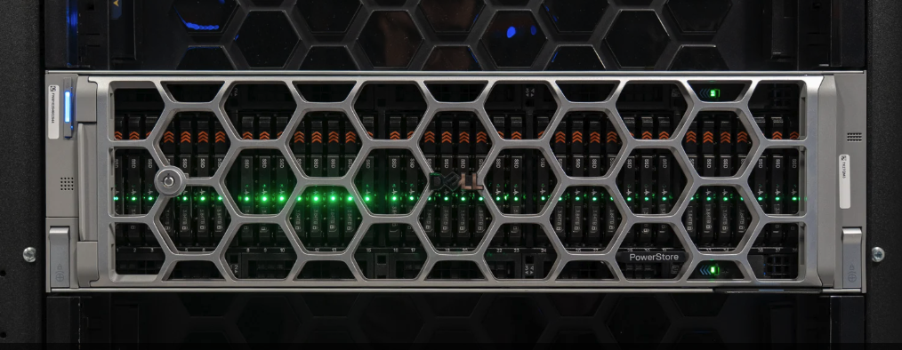

 

<a class="news-card" href="https://www.storagereview.com/zh-TW/review/dell-powerstore-gen-3" target="_blank">
  
  
新聞PowerStoreDell

  
戴爾 PowerStore 第三代

  
多年來最激進的企業儲存變革

</a>

<a class="news-card" href="https://techorange.com/2026/05/26/delltechnologies-private-cloud-automation-platform-powerstore/" target="_blank">
  
  
新聞DPCDell

  
Dell Private Cloud

  
打造兼具彈性與效率的現代化架構

</a>

### **官方連結**
[NVIDIA Drivers 官方下載](https://developer.nvidia.com/datacenter-driver-archive) 
[Fabric Manager 官方下載](https://developer.download.nvidia.com/compute/nvidia-driver/redist/fabricmanager/linux-x86_64/) 

### **Target Code快速查詢**
[Dell Connectrix](https://www.dell.com/support/kbdoc/en-us/000228560/minimum-recommended-and-latest-code-versions-for-networking-products) 
[Dell PowerStore](https://www.dell.com/support/kbdoc/zh-tw/000175213/powerstoreos-matrix) 
[Dell Unity](https://www.dell.com/support/kbdoc/en-us/000020641/dell-emc-unity-oe-revision-matrix?lang=en) 

---
!!! info "聯絡資訊"
    

    **Line ID:** andy0583&nbsp;&nbsp;&nbsp;&nbsp;**Email:** andy0583@gmail.com 
    **Certificate:** PMP、Dell、Netapp、VMware、RedHat、Veeam、Gemini、Claude code 
    如有任何技術問題或建議，歡迎隨時與我聯繫。 
    **請保持心中的光，因為你不知道，誰會藉著你的光走出黑暗。**
    

    ---
    &nbsp;&nbsp;&nbsp;&nbsp;&nbsp;
    &nbsp;&nbsp;&nbsp;&nbsp;&nbsp;
    
