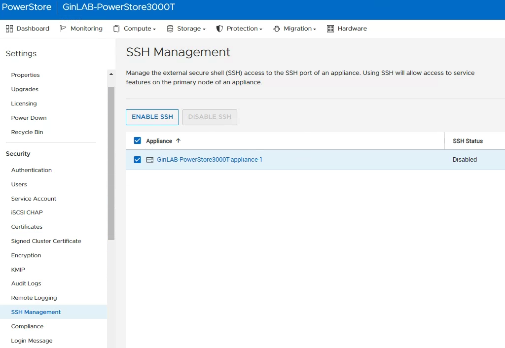

# PST Log collection

**先開啟PowerStore SSH**



GUI-Gather Support Materials：每天自動收集Config+Log，亦可以手動（檔案幾GB）

GUI-Metrics Archives：手動收集效能檔（檔案幾百MB）

CLI-svc_arrayconfig：手動收集Config且無Log（檔案幾百KB），依據此配置檔，Support可使用”svc_restore_config”指令(Only for support)來還原整座Storage

CloudIQ會定期將Config+Log上傳。

**配置檔資訊下載：只能跑在primary node**

- User ID：service

```bash
mkdir cc
svc_arrayconfig run -f json --output cc --type full --config /cyc_host/cyc_service/conf/ConfigCaptureConfig_ProDeploy.json
ls cc/*.json |wc -l
tar -zcvf array_config_collection.tar.gz cc/*.json
tar -ztvf array_config_collection.tar.gz |wc -l
```

- 抓下這個檔案：array_config_collection.tar.gz
- 上傳Central

**效能檔案下載：**

pstcli -d [10.9.10.20](http://10.9.10.20/) -u admin -p P@ssw0rd -ssl accpet -ssl stroe  第一次要先接受憑證

[SVC:service@C1F0C43-B user]$ pstcli -service  -d 10.9.10.20 -u admin -p P@ssw0rd support_metrics_archive generate -start_offset 5209600 -end_offset 0

Success

#  |    archive_id

- ---+--------------------------------------

1 | 072d9c6c-8bda-4454-a13b-f2c3eb65c250

[SVC:service@C1F0C43-B user]$ ll /cyc_cfs/service/support_metrics/archived

total 12

drwxrwsr-x 2 root cycg 4096 Jul 27 06:27 2021-07-27T06-27-15-718869

drwxrwsr-x 2 root cycg 4096 Jul 27 06:39 2021-07-27T06-39-10-761178

drwxrwsr-x 2 root cycg 4096 Jul 27 06:57 2021-07-27T06-57-07-621311

[SVC:service@C1F0C43-B user]$ ll /cyc_cfs/service/support_metrics/archived/2021-07-27T06-57-07-621311

total 20852

- rw-rw-r-- 1 root cycg 21348382 Jul 27 06:57 PowerStore_PS2a0d1c4af84e_2021-07-13T06-57-07_2021-07-27T06-57-07_support-metrics.tar.gz

[SVC:service@C1F0C43-B user]$ cp /cyc_cfs/service/support_metrics/archived/2021-07-27T06-57-07-621311/PowerStore_PS2a0d1c4af84e_2021-07-13T06-57-07_2021-07-27T06-57-07_support-metrics.tar.gz /home/service/user

**效能數據保留：**

Five seconds data 保留一小時
20 seconds data 保留一小時
Five minute data 保留1天
One hour data 保留30天
One day data 保留2年
