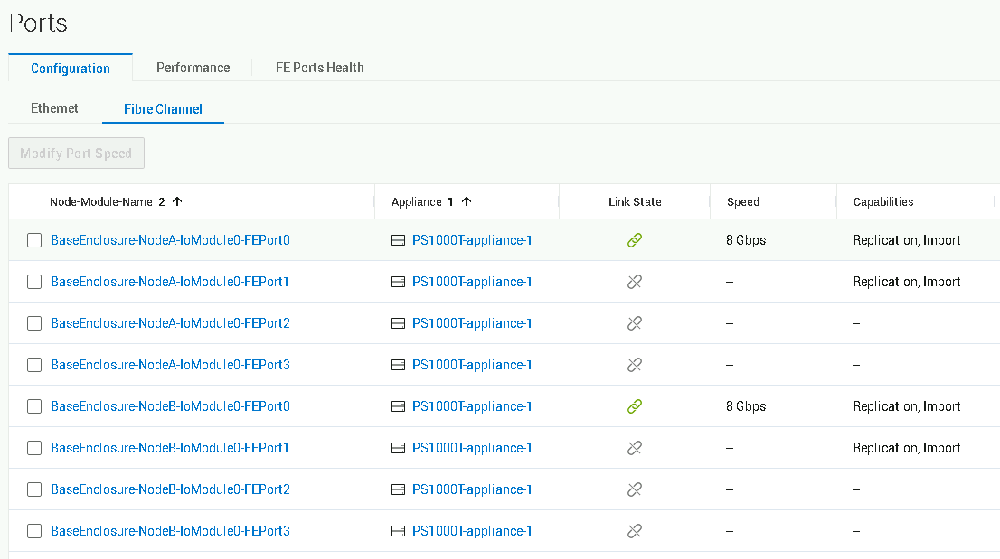
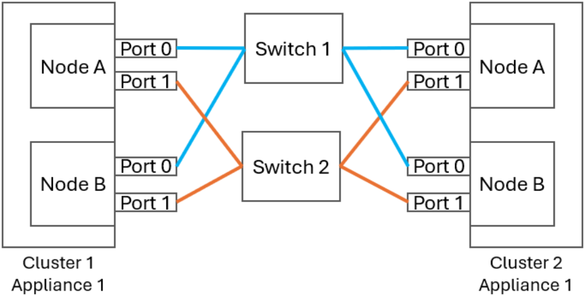
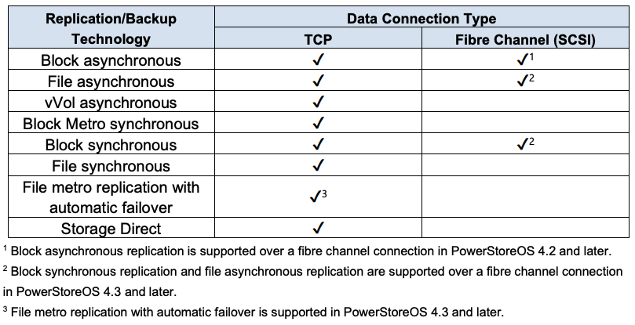

# PST Replaction

- Powerstore OS 4.3以後支援FC Sync。
- 同步複製需要低延遲網路（<5毫秒）
- PowerStore 光纖通道複製不支援群集間複製連接埠的直接連線
- 建議Replication獨立Port
- 只有下圖0與1可使用
  

- 每個分區還應僅包含一個來源連接埠和一個目標連接埠。
    - C1A0 - C2A0、C1A0 - C2B0
    - C1B0 - C2A0、C1B0 - C2B0
  

- Powerstore OS 4.3之後支援：
    - Block Synchronous replication over Fibre Channel：新增對Block使用FC進行Sync Replication。(必須使用SAN SW)
    - File Asynchronous replication over Fibre Channe：新增對File使用FC進行Async Replication。(必須使用SAN SW)
    - File Metro：NAS使用Witness，可達成自動切換（MetroSync）。
  
